# 27-Hour Data Engineering Bootcamp

Saturday, August 8, 2026

2:00 PM

[Data Engineer Bootcamp (FREE 27+ Hour Course) - SQL, Python, Cloud, Bash, AI, Git & GitHub](https://www.youtube.com/watch?v=ol9_NnC9-cc&t=4s)

Also check this one out: [Databricks vs Snowflake vs Fabric: Which One Should You Learn?](https://www.youtube.com/watch?v=yPGEQ8vtuOw)

- ## Screenshots


- Data Engineer = pipe your data into your analytical systems
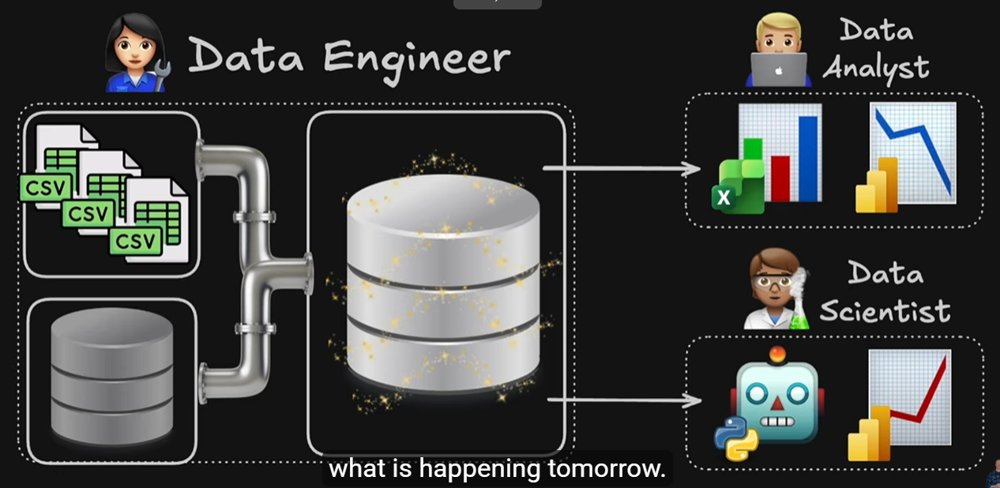
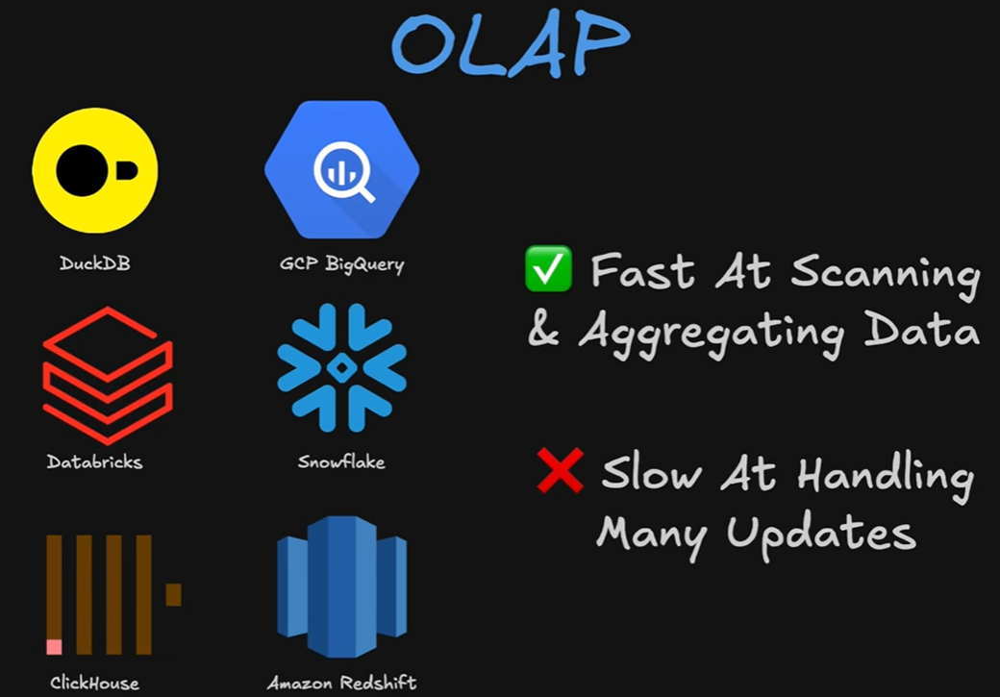
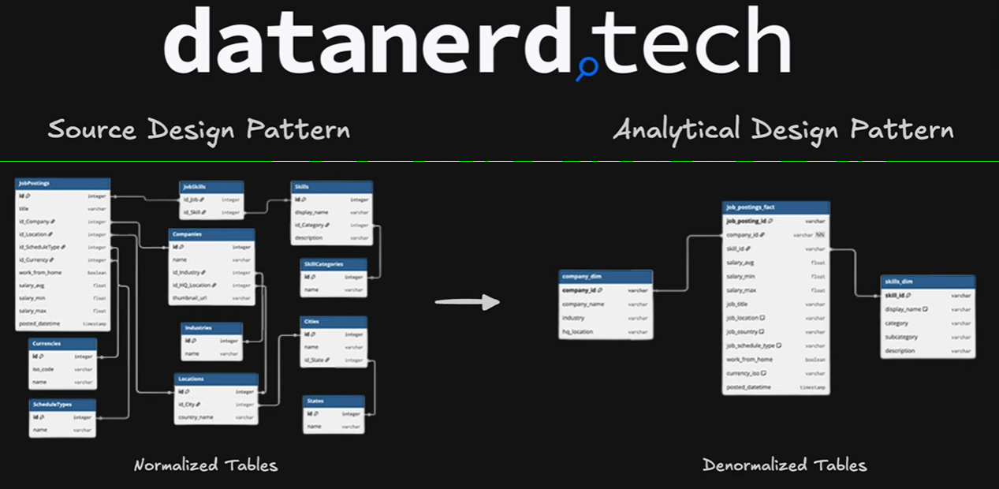

### Star Schema
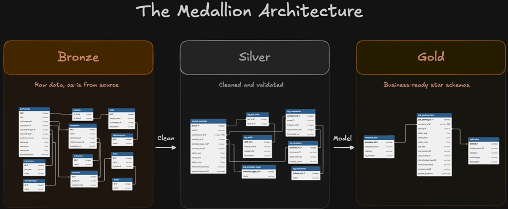
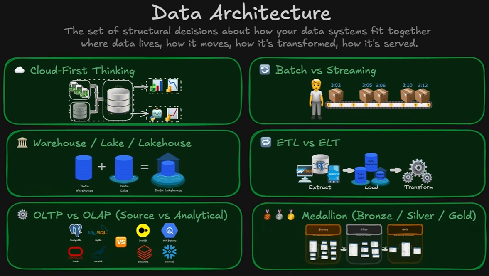
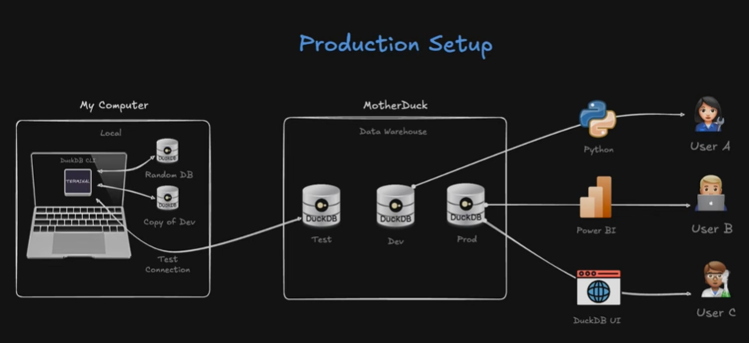
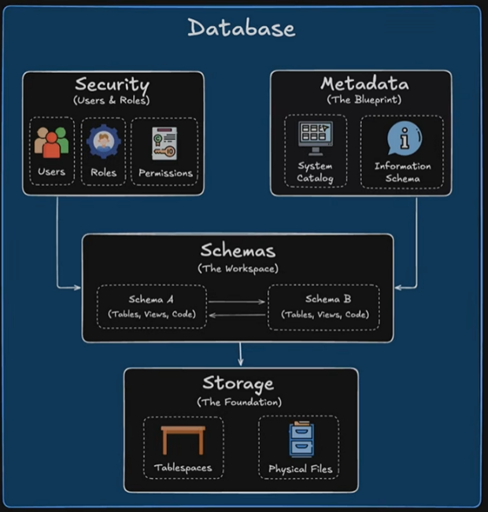
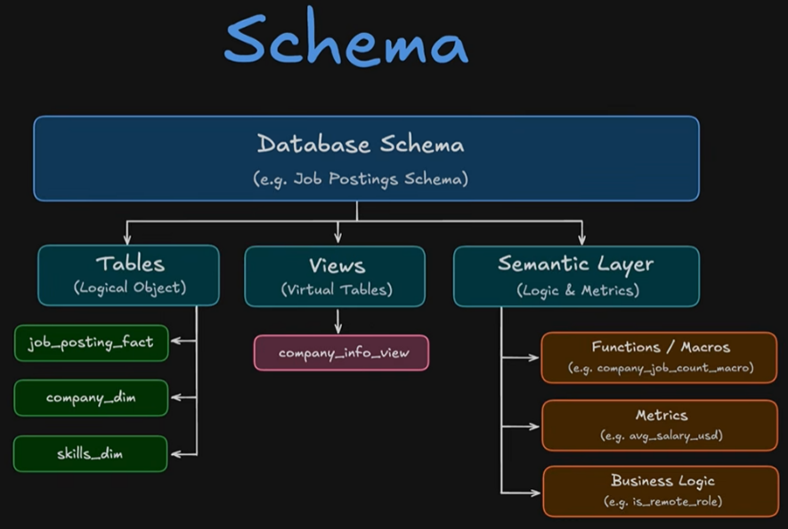
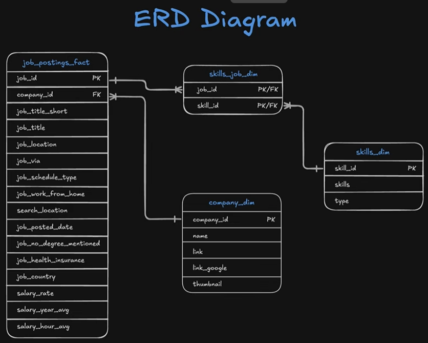

- The two fields in the `skills_job_dim` table are called **composite primary key** because the combination of the two columns acts as a primary key (if you just used one of the columns by itself it would not be a unique primary key, you need both concatenated)\`- meanwhile (and separate from the "Composite" topic) they are also foreign keys for the sake of their connection to the `job_id` and `skill_id` primary keys on the 2 connected tables

## Part 1

### Terminal
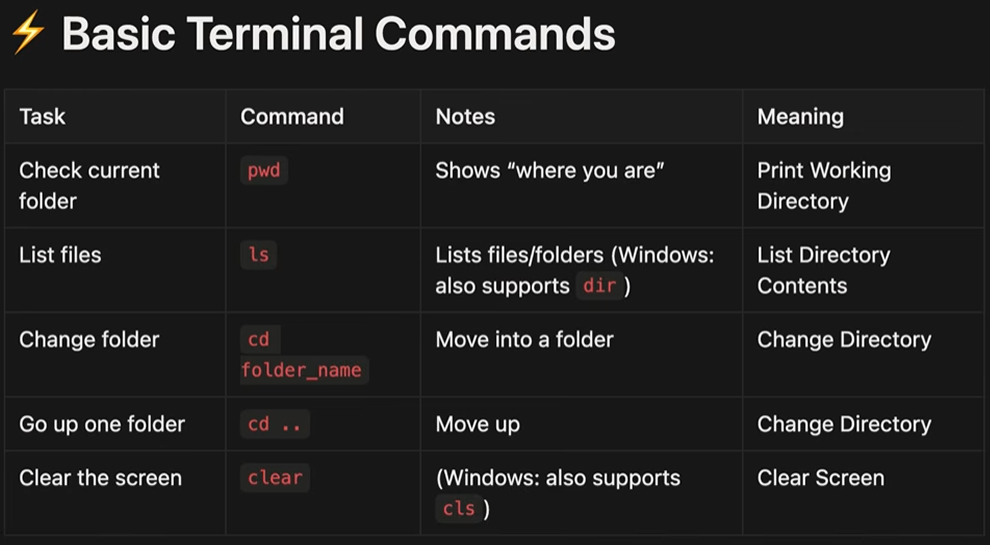

- ### Code we ran to introduce us to terminal

```bash
uia09337@CQL4137W MINGW64 ~/Desktop

$ echo "Data Analyst" > file1.txt

uia09337@CQL4137W MINGW64 ~/Desktop

$ cat file1.txt

Data Analyst

uia09337@CQL4137W MINGW64 ~/Desktop

$ echo "Data Nerdz" >> file1.txt

uia09337@CQL4137W MINGW64 ~/Desktop

$ cat file1.txt

Data Analyst

Data Nerdz

uia09337@CQL4137W MINGW64 ~/Desktop

$ head file1.txt

Data Analyst

Data Nerdz

uia09337@CQL4137W MINGW64 ~/Desktop

$ head -n 2 file1.txt

Data Analyst

Data Nerdz

uia09337@CQL4137W MINGW64 ~/Desktop

$ head -n 1 file1.txt

Data Analyst

uia09337@CQL4137W MINGW64 ~/Desktop

$ nano file1.txt

uia09337@CQL4137W MINGW64 ~/Desktop

$ cat file1.txt

Data Analyst

Data Nerdz

Data Scientist

Data Engineer

uia09337@CQL4137W MINGW64 ~/Desktop

$ man ls

bash: man: command not found

uia09337@CQL4137W MINGW64 ~/Desktop

$ ls --help
```

### Metadata

  - Use `information_schema` - read only tables that house the data defining the database
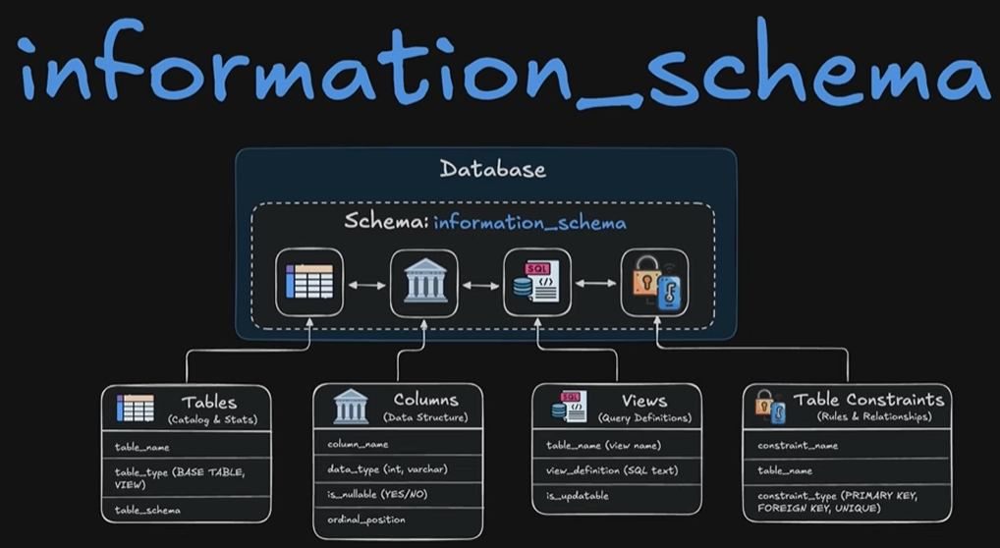

### SQL Order of Execution

**Stages:** Parser, Optimizer, and Executor

- **Parser:** Checks your syntax.

- **Optimizer:** Determines the most efficient way to run the query and may rewrite it behind the scenes.

- **Executor:** Runs the optimized plan step by step, reading data, applying filters and joins, grouping aggregates, and returning the required rows.

#### Written clause order

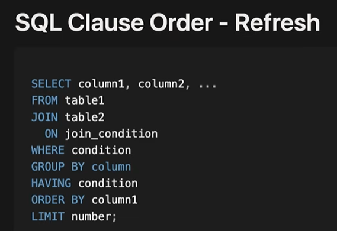

#### Logical order of operations

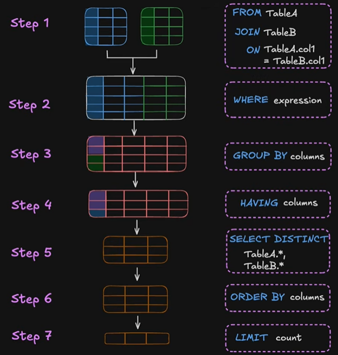

> **Reminder:** `HAVING` filters aggregates, similar to how `WHERE` filters rows.

Table name aliases can be used throughout because they occur in Step 1 of the order execution, but aliasing something like a column name cannot be references in a group by cause for example, and this is because of order execution. Group by occurs in Step 3 before the alias is defined for the column in Step 5

However you CAN use the column aliases in Order By, because it comes after Step 5! Just not in WHERE/Group By unfortunately

- **`EXPLAIN`:** Place it before a query to view the execution plan. It does not execute the query, so row-count estimates are prefixed with `~`.

- **`EXPLAIN ANALYZE`:** Executes the query and provides actual row counts and runtimes.

> **Tip:** Read the execution-plan output in VS Code from bottom to top.

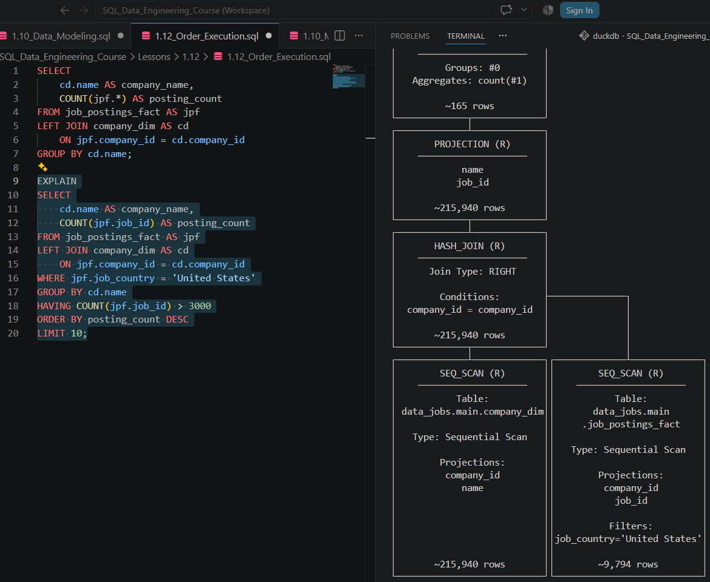

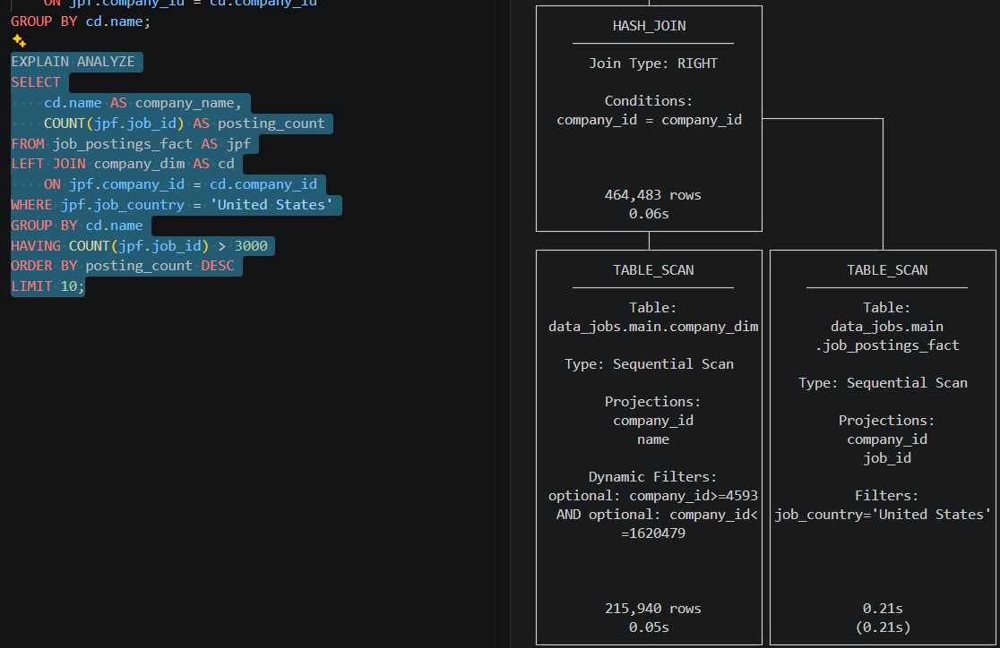

[Markdown Cheat Sheet \| Markdown Guide](https://markdownguide.offshoot.io/cheat-sheet/)
