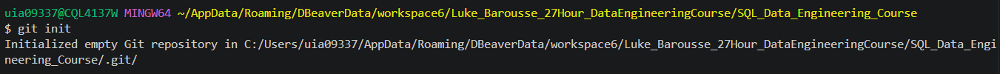

# File so I can record notes on setting up Git repositories since I can't seem to "committ" it to memory

```terminal
One time global git bash setup config in bash terminal: 

uia09337@CQL4137W MINGW64 ~
$ git --version
git version 2.52.0.windows.1

uia09337@CQL4137W MINGW64 ~
$ git config --global user.name "Cameron Jamrok"

uia09337@CQL4137W MINGW64 ~
$ git config --global user.email "cameron.jamrok@conti-na.com"

uia09337@CQL4137W MINGW64 ~
$ git config --global core.editor "nano"

uia09337@CQL4137W MINGW64 ~
$ git config --list --show-origin
file:C:/Users/uia09337/AppData/Local/Programs/Git/etc/gitconfig diff.astextplain.textconv=astextplain
file:C:/Users/uia09337/AppData/Local/Programs/Git/etc/gitconfig filter.lfs.clean=git-lfs clean -- %f
file:C:/Users/uia09337/AppData/Local/Programs/Git/etc/gitconfig filter.lfs.smudge=git-lfs smudge -- %f
file:C:/Users/uia09337/AppData/Local/Programs/Git/etc/gitconfig filter.lfs.process=git-lfs filter-process
file:C:/Users/uia09337/AppData/Local/Programs/Git/etc/gitconfig filter.lfs.required=true
file:C:/Users/uia09337/AppData/Local/Programs/Git/etc/gitconfig http.sslbackend=schannel
file:C:/Users/uia09337/AppData/Local/Programs/Git/etc/gitconfig core.autocrlf=true
file:C:/Users/uia09337/AppData/Local/Programs/Git/etc/gitconfig core.fscache=true
file:C:/Users/uia09337/AppData/Local/Programs/Git/etc/gitconfig core.symlinks=false
file:C:/Users/uia09337/AppData/Local/Programs/Git/etc/gitconfig pull.rebase=false
file:C:/Users/uia09337/AppData/Local/Programs/Git/etc/gitconfig credential.helper=manager
file:C:/Users/uia09337/AppData/Local/Programs/Git/etc/gitconfig credential.https://dev.azure.com.usehttppath=true
file:C:/Users/uia09337/AppData/Local/Programs/Git/etc/gitconfig init.defaultbranch=master
file:C:/Users/uia09337/.gitconfig       core.editor=nano
file:C:/Users/uia09337/.gitconfig       user.email=cameron.jamrok@conti-na.com
file:C:/Users/uia09337/.gitconfig       user.name=Cameron Jamrok
file:C:/Users/uia09337/.gitconfig       gui.recentrepo=C:/Users/uia09337/AppData/Roaming/DBeaverData/workspace6/Luke_Barousse_Intermediate_SQL_Training_Course - Copy because GIT HUB is RUDE

uia09337@CQL4137W MINGW64 ~
$
```

## Init Git
```git
once your terminal is pointed to the correct repository, use "git init" in terminal. Then your hidden git folder will appear in explorer. 
```



## Git Branching


- also ran this code to make "main" the default primary branch, not "master". 
- This was a global config setting so I shouldn't have to run it ever again. 
- ```git config --global init.defaultBranch main```


[Luke Commit Git](https://youtu.be/ol9_NnC9-cc?si=0JZh4nzTeegkdr37&t=23545)
- this was where we used git add and git commit to publish all of our changes to the main branch
- "Read along with Git Commands Image above" - we took untracked changes that were in our working directory, used git add to put them into our staging areas, then used git commit to get them into our local repo. 
- right now only our 1_EDA_Project folder is committed, so we need to get everything else too. Use "git add ." to add everything to the staging area:


- for some reason relative path copying doesnt work out of the box - need to swap for forward slash if you're trying to snip add/commit one specific file. 

- Clean house - clean staging area with everything committed. See top left. Publish Branch button only becomes available once The staging area is empty and everything is committed to be published. Commit first - then publish branch.

```
$ git status
On branch main
nothing to commit, working tree clean
```
- this means you're ready to publish your fill branch, nothing in the staging area!

## This is so cool to me
- 
- track your changes (green means new addition, red means deletion of code) by running "git diff" or by double clicking the Changed file in the Source control window.

# Git Push
- this is where we push local repository changes up to github!
1. we started by logging into github and creating a new public repository. 
[github/cjamrok/SQL_Data_Engineering_Course](https://github.com/cjamrok/SQL_Data_Engineering_Course)
2. We were then presented with this screen and it gives you the gitbash code you need to run for one of 2 circumstances. In this case we chose the highlighted one at the bottom, because we created the local repository first, and the hub repo second. (If it had been the other way around we would have done the 2nd longer string of code to create a new local repository to match up with the hub repo we just set up).
- 
3. git remote command
- git remote add origin https://github.com/cjamrok/SQL_Data_Engineering_Course.git
4. 
5. 

## Next up is merge and fetch
1. Luke changed the contents of a sql file on github rather than locally in VS code. 
2. Now we need to pull those changes down with fetch.
3. go back to the git command screenshot for help! fetch will pull the hub repo changes into your staging area, but NOT your working directory. So until you run git merge, you won't see those changes appear in vs Code/local files.
4. 
5. git push -u origin main
6. git fetch 
7. git merge origin/main
8. git status
9. origin/main = remote hub repo
10. Lastly doing a git pull (combines git fetch and git merge into one action)
- 

## didn't fully understand these:
- $ git diff Head..origin/main


