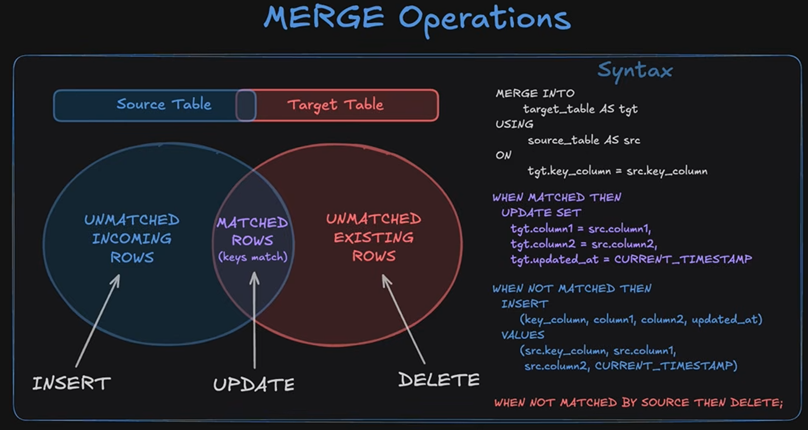
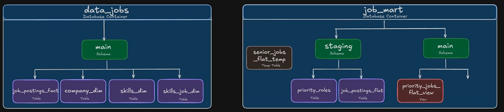

## Data Pipelines - Serious (I think) Data Engineering Staging/Merge Type Shit:

[Luke_Link](https://youtu.be/ol9_NnC9-cc?si=AuBhxePtwSoOT-Do&t=32010)

Process Luke explained: **he also mentioned that this was effectively us building a data mart!**

Business Updated Table: [1_Priority_Roles_Redo.sql](../Lessons/1.24_Redo-DataPipeliningExample/1_Priority_Roles_Redo.sql)
1. Initial Load - one time load to populate target table. Create table for snapshot and load all data into it. [2_Priority_jobs_snapshot-Initial_Load.sql](../Lessons/1.24_Redo-DataPipeliningExample/2_Priority_jobs_snapshot-Initial_Load.sql)
2. On a daily basis we go through and perform a "batch load", and this version will use a combo of update, insert and delete statement to maintain snapshot table up to date. [3_Priority_jobs_snapshot-Batch_Update_V1-Insert_Update_Delete.sql](../Lessons/1.24_Redo-DataPipeliningExample/3_Priority_jobs_snapshot-Batch_Update_V1-Insert_Update_Delete.sql)
3. Update batch loading into our "V2" that relies just on Merge to combine what we will do in #2, doing exact same thing as #2 - only sexier

-Good Merge explanation/diagram, also a separate image with syntax:

[3_Priority_jobs_snapshot-Batch_Update_V1-Insert_Update_Delete.sql](../Lessons/1.24_Redo-DataPipeliningExample/3_Priority_jobs_snapshot-Batch_Update_V1-Insert_Update_Delete.sql)

Our Goal is to pipe our data in from data_jobs to job_mart:

