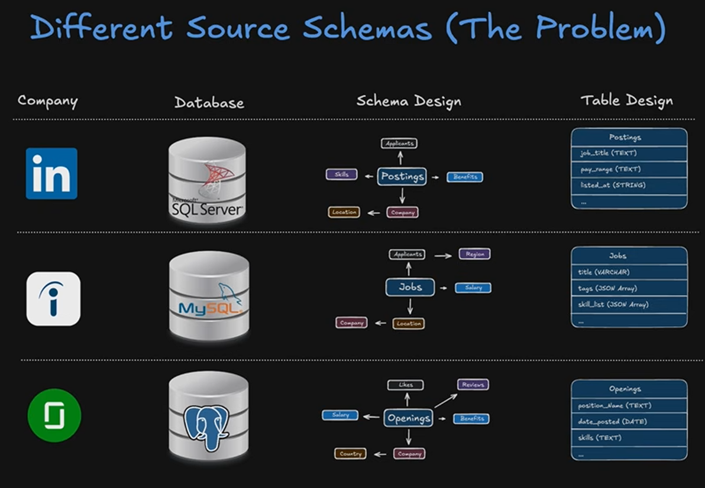
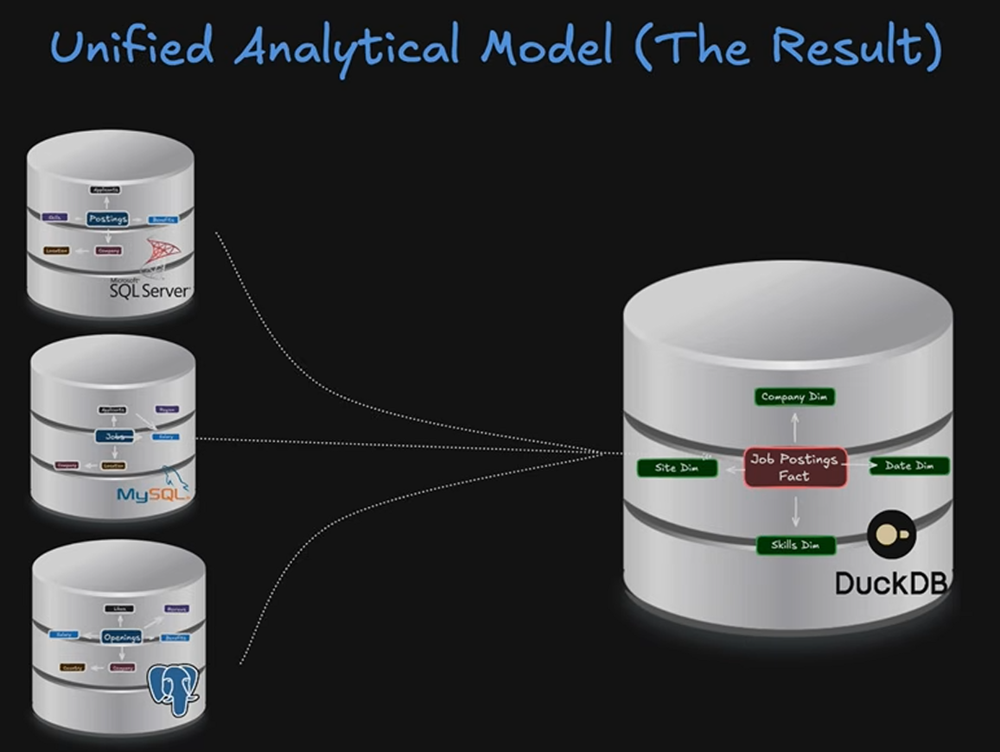
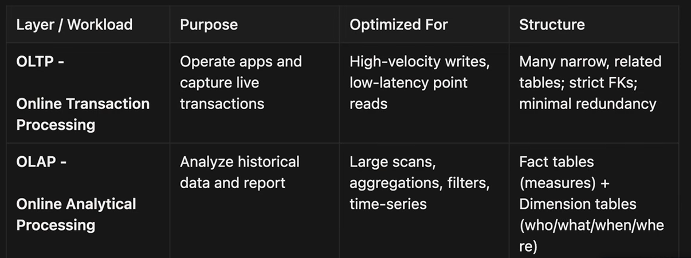
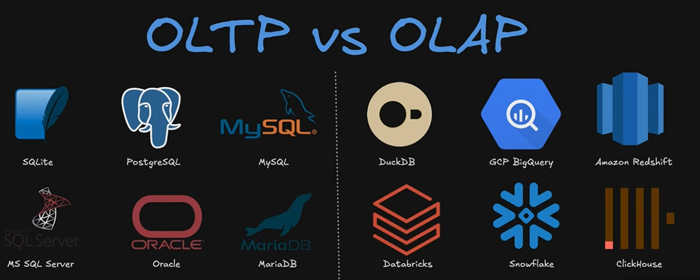
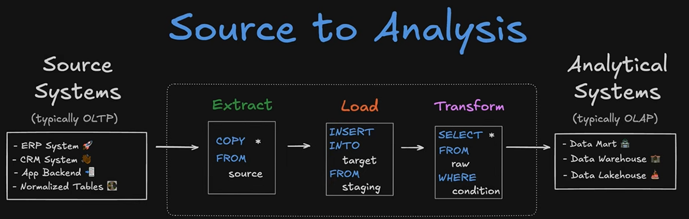
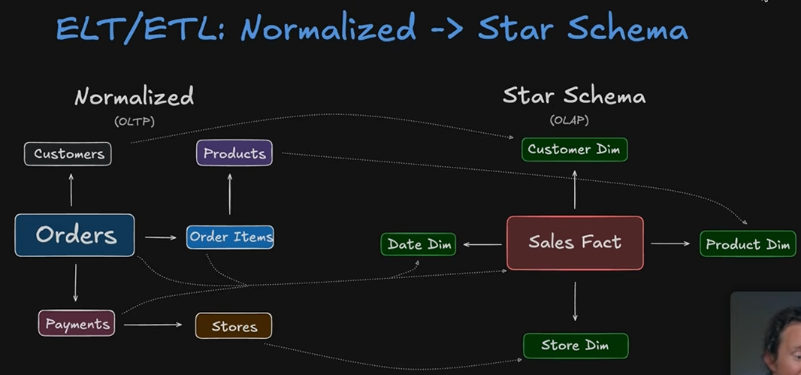
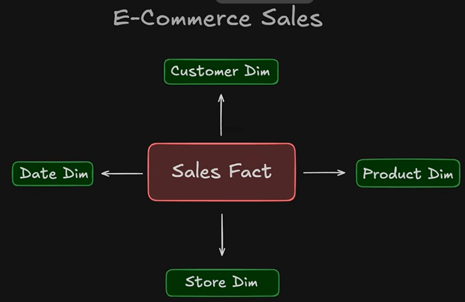
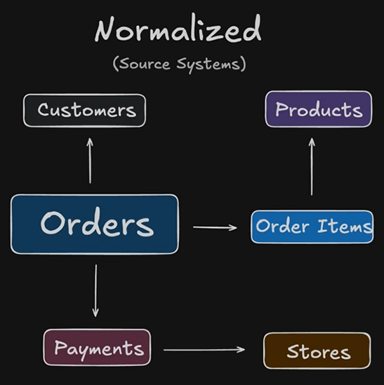

# Data Modeling
- helps by bringing in structure and consistency

1. The Problem - how do you query data that comes from 3 different sources that are each set up a little differently?

2. A Solution 

## Database Types

1. OLTP - for capturing live txns. High velocity writes, constantly writing to DB. 
2. OLAP - optimized for analysis, aggregated scans, filters. Often stored in fact/dimension star schema layout. 

You can use ETL to transform your normalized source system data to a star schema instead for analysis!

## Core Design Patterns (Star Schema is most important)

lots of these 7 of these though are based off of or a modified version of star schema

1. Star Schema - One central fact table, surrounded by dimensions tables
    - fact = txns/quantitative
    - dims = provide decriptive/context qualitative data (who what when where)
    - most common design used in OLAP systems especially
    

Most common design principal for OLTP/source systems is a "normalized schema". This is a DB design where data is split into multiple related tables. Goal is to reduce duplication and maintain data integrity by only storing the instance of data exactly once.  

2. Constellation schema aka Galaxy schema = collection of different star schemas

3. Snowflake schema = fact table surrounded by dimension tables, but your dimension tables have other tables being joined to the "main" dimension tables

4. Factless Fact. No numberic/quantitative measures in the main fact table.

5. Bridge Table = acts as an intermediary between 2 other tables that allows a cleaner many to many * => * relationship. The bridge table includes foreign keys that connect to the primary keys of the two other tables. 

- in this screenshot example, the bridge table allows us to query and pull in the dimensional skills and type data columns into a query on our fact table. Without the bridge table, we'd have to move skill_id into jpf and the job_id into the skills_dim table, which would create an awful * to * relationship. 

6. Flat/Wide Tables = all the relevant attributes for reporting are joined into one very wide table with tons of columns

