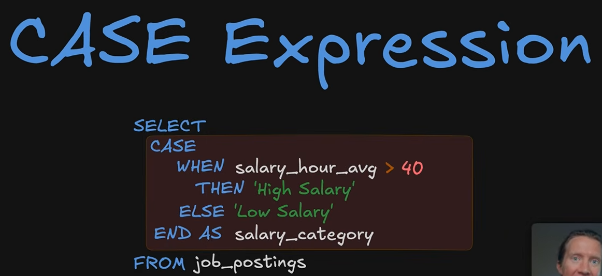
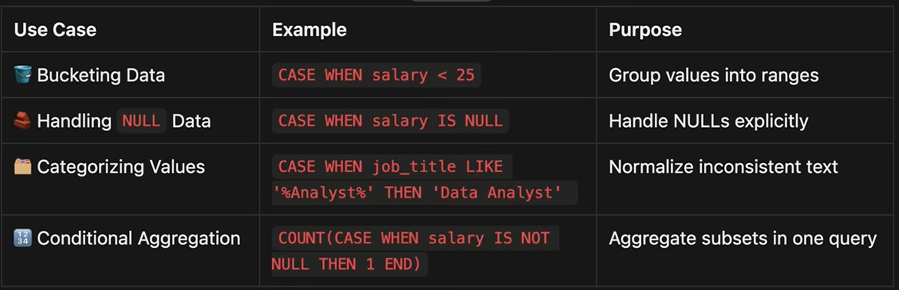
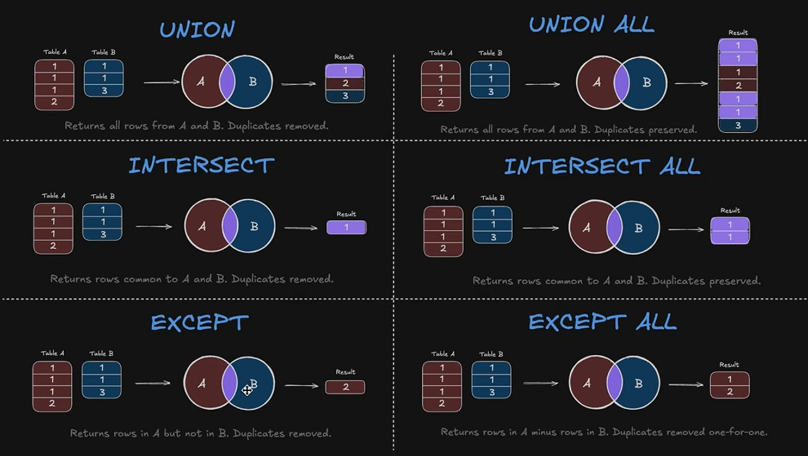
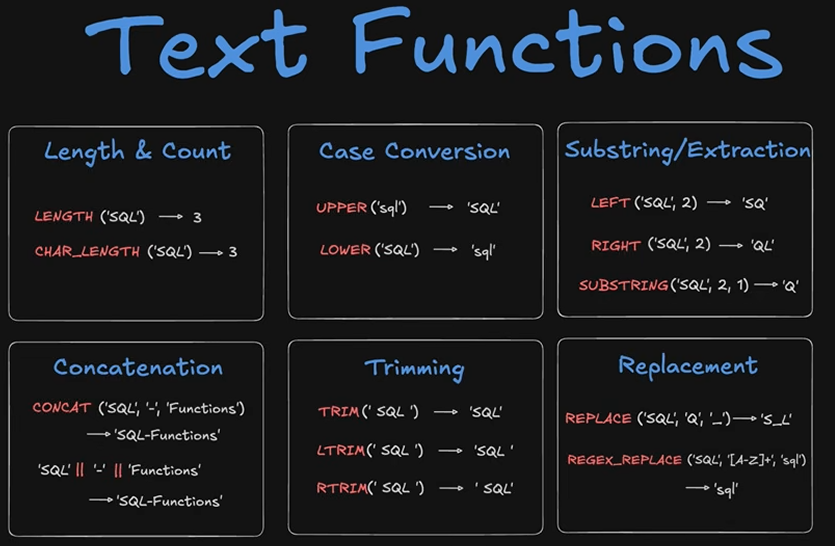
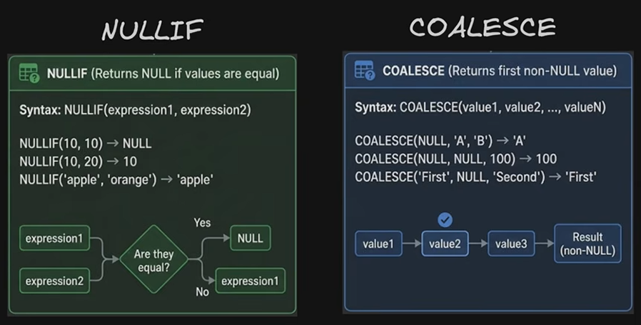

# Case Expressions

- you can use case/when expressions even in order bys or where clauses, who knew? 

-Data Engineering use cases!

[CaseExpressions.sql](../Lessons/1.25/1.25_CaseExpressions.sql)

# Date and Time Functions
[1.26_DateFunctions.sql](../Lessons/1.26/1.26_DateFunctions.sql)

# Set Operators

[1.27_Set_Operations.sql](../Lessons/1.27/1.27_Set_Operations.sql)

# Text and NULL Functions

[1.28_Text&Null_Fxns.sql](../Lessons/1.28/1.28_Text&Null_Fxns.sql)

