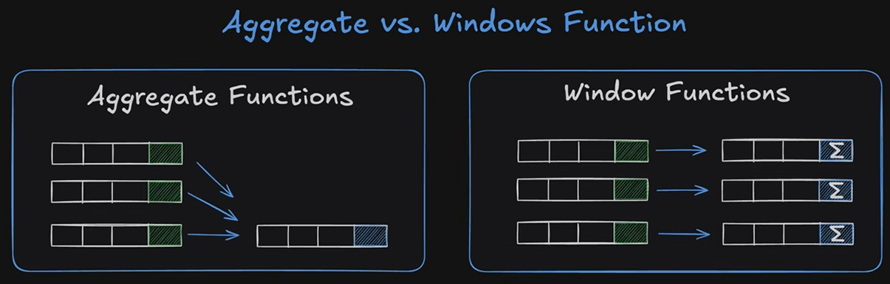
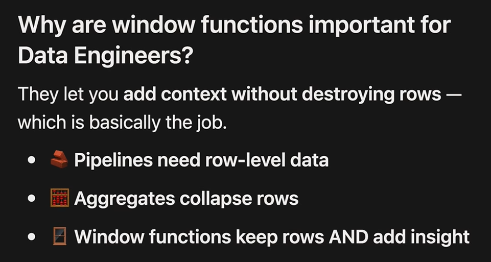
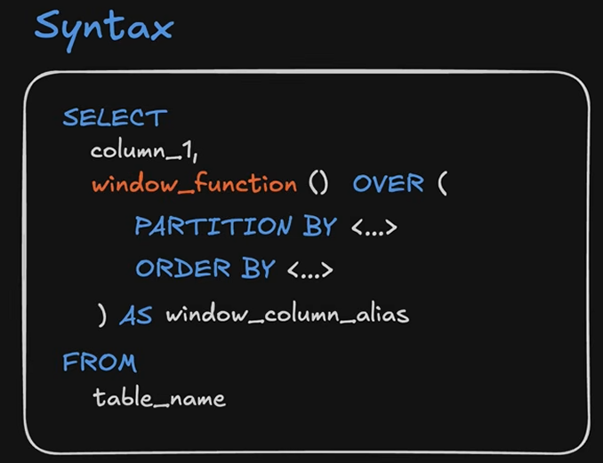
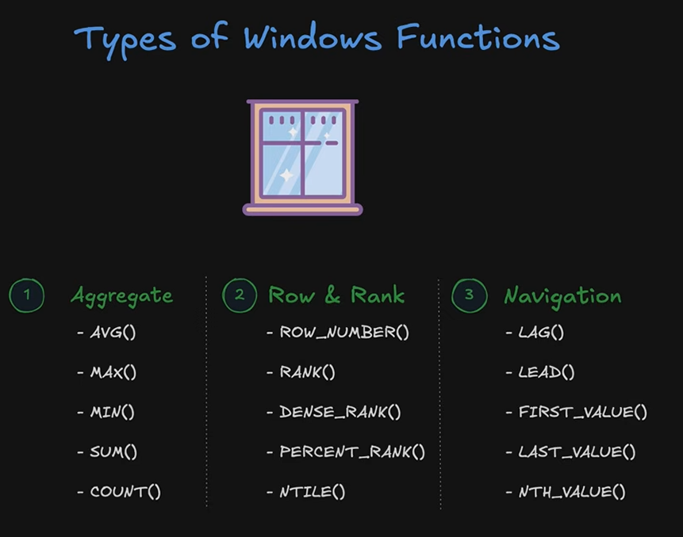
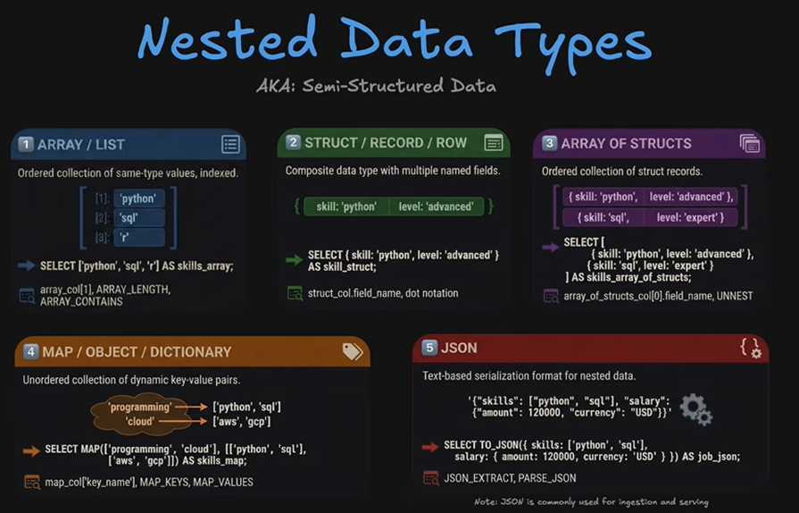

# Case Expressions

- you can use case/when expressions even in order bys or where clauses, who knew? 

-Data Engineering use cases!

[CaseExpressions.sql](../Lessons/1.25/1.25_CaseExpressions.sql)

# Date and Time Functions
[1.26_DateFunctions.sql](../Lessons/1.26/1.26_DateFunctions.sql)

# Set Operators

[1.27_Set_Operations.sql](../Lessons/1.27/1.27_Set_Operations.sql)

# Text and NULL Functions

[1.28_Text&Null_Fxns.sql](../Lessons/1.28/1.28_Text&Null_Fxns.sql)

## use case for nullif is often simply divide by zero erros
--SELECT Sales / NULLIF(Quantity, 0)
2
FROM Orders;

# Window Functions

[1.30_Window_Functions.sql](../Lessons/1.30/1.30_Window_Functions.sql)

## You need Order Bys in a windows function for any kind of ranking and/or running average/running totals

# Nested Data (Array)
## I think this is like a set or unique concatenate in Knime?

Array = [   ] - all values must be the same data type

Struct = {   } - contains multiple named fields, so its like multiple columns in one and the columns and the values are defined inside of the strut. Yes these need same data types as well

Array of Struct = "most common I've found to be used in Data Engineering." 
    
    --one row, an array [] of structs {} = [{},{}]
    

## One single array of 4 structs:

MAP

JSON = "Javascript Object Notation". Common to receive data in this format if you're accessing it via an API and you have to unpack it

Use Case Exmaple: in this table, list out all the skills in one row without repeating the same job title once per skill:

=>

[1.31_Nested_Data.sql](../Lessons/1.30/1.31_Nested_Data.sql)

[1.32_Array_Final_Example.sql](../Lessons/1.30/1.32_Array_Final_Example.sql)