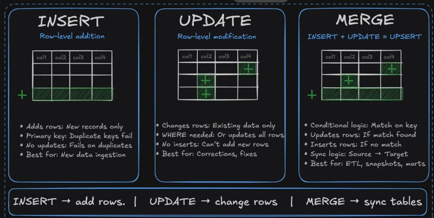
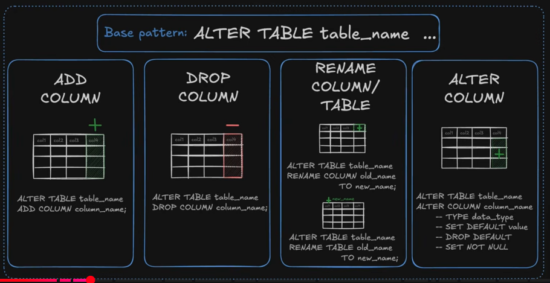
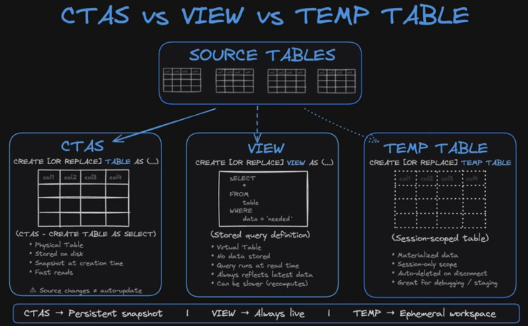
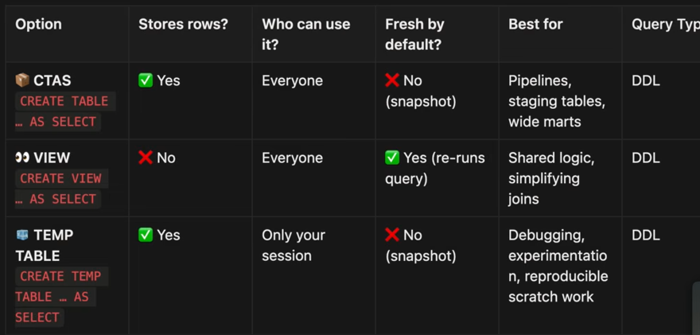
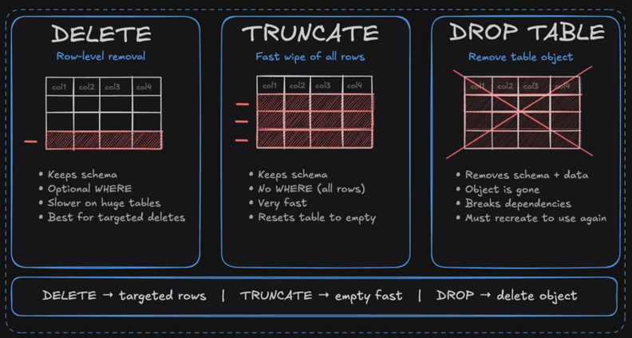
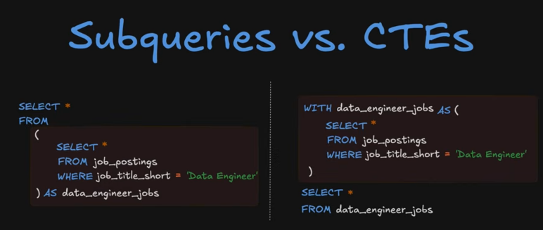
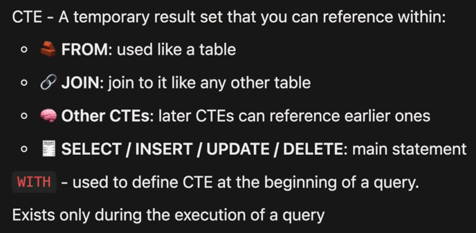

# DML



- INSERT INTO - will only load rows that don't already exist in the table! 
- actually after testing and watching luke work, I think it only prevents duplicate row insertions if/when you have a proper primary key set up - which will make whole row insertion fail




- "Idempotent" scripts. A script is "Idempotent" if you can run it all the way through from start to finish. If you go here for example: 
[1.21_DDL_DML_Pt1.sql](../Lessons/1.20/1.21_DDL_DML_Pt1.sql) and execute this whole damn query, it will run through and recreate everything without throwing any errors. This is because we utilized "CREATE **OR REPLACE** TABLE/VIEW" and "CREATE TABLE IF NOT EXISTS", essentially adding iferror / error controls to make the whole script able to execute all the way through with no errors.
- equally important I think are the ";", because you need to tell the script which queries/actions should be completely finished before the next one begins. Save points basically. 
- run a whole scipt at once:


## Part 2 DDL



Swapping over to [1.22_DDL_DML_Pt2.sql](../Lessons/1.20/1.22_DDL_DML_Pt2.sql) for part 2

"Truncate" = remove all rows from a table

1. CTAs ("Create Table AS Select") - table created inside a schema for really fast reads
2. Virtual table / query. Live. No data is stored, just queried. 
3. Temp Table - materialized data that is stored into a temporary table that will be removed automatically once you log out. 
    I'm intrigued by temp tables, it sounds like it acts as a CTE/Subquery "save point" - you get the first aggregation/joined table that you want to analyze, save it temporarily, and then from there you can query that temp table to dive in deeper and get your questions answered. 



Summary from Luke:
1. Latest data for every query = view
2. Fast views and stable results = CTAs
3. Testing/debugging = Temp Tables




Truncate is faster than DELETE FROM Table

## Subqueries and CTEs



Good idea to start with your subqueries and execute them first, then paste them where needed into your main query:

```
SELECT job_title_short, median(salary_year_avg) as median_salary,
(SELECT median(salary_year_avg) FROM job_postings_fact
WHERE job_work_from_home = TRUE) AS market_remote_median_salary
FROM job_postings_fact
GROUP BY job_title_short
```



## Where Exists/Not Exists


[existence_filtering_link](https://youtu.be/ol9_NnC9-cc?si=siL57oX2ApN0MyzN&t=31337)

Using Subqueries, compares data in two tables where rows exists in both (or don't)
1. Where Exists = only show rows that exist in both the src table and target table
2. Where Not Exists = only show rows that exist in  the src table but don't exist in the target table

Syntax: 
```
SELECT * FROM target_table as tgt
WHERE NOT EXISTS (
    SELECT 1 
    FROM source_table AS src
    WHERE src.key = tgt.key
)
```

## Data Pipelines - Serious (I think) Data Engineering Staging/Merge Type Shit:

[Luke_Link](https://youtu.be/ol9_NnC9-cc?si=AuBhxePtwSoOT-Do&t=32010)

Process Luke explained:
[Priority_Roles.sql](../Lessons/1.24/Priority_Roles.sql)
1. Initial Load - run only once. Create table for snapshot and load all data into it. 
2. On a daily basis we go through and perform a "batch load", and this version will use a combo of update, insert and delete statement to maintain snapshot table up to date
3. Update batch loading into our "V2" that relies just on Merge to combine what we will do in #2, doing exact same thing as #2 - only sexier

-Good Merge explanation/diagram:
