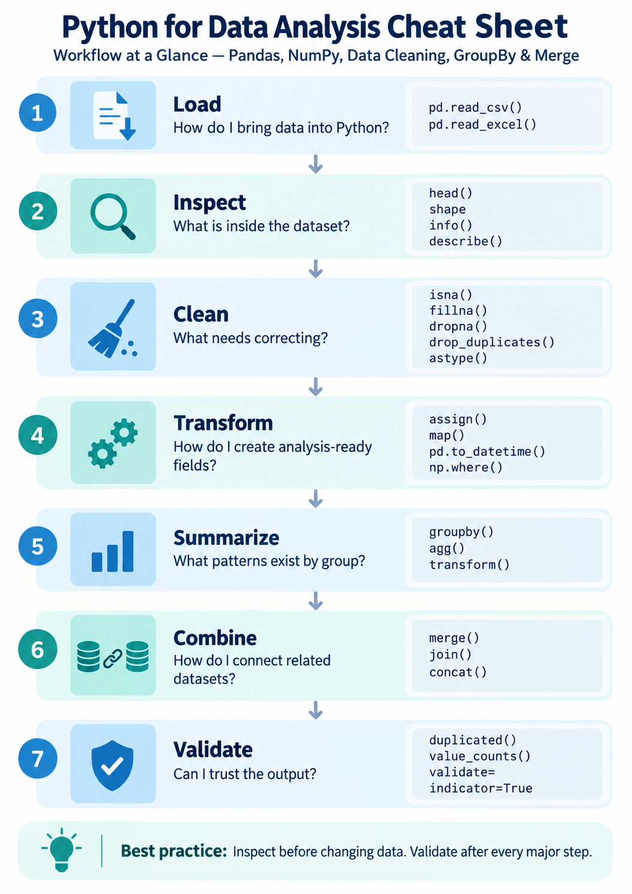
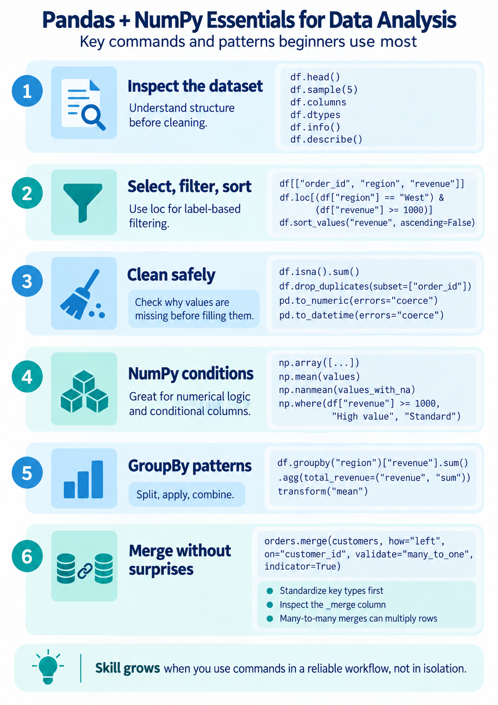

Can you draw inspiration from these to really think through and standardize your VDIL workflows? Have a script you can follow. 

***VDIL Knime data transfer script:***
nothing finalized here, just a snapshot of what little I have so far as of 10/1/26:

Figure out which VDIL Placeholder parameters can be ignored. I trust WHERE > Placeholder any day of the week. Just comment them out one a time to see which ones are truly required. 

Clearly defined Data Types - strings, dates, floats and integers

Resort Columns, by data type, then alphabetically - I like Strings, then dates, then integers/floats at the very end. But gets tricky don't forget b/c dates are often stored as dates, strings and integers depending on column. 

validation -  Hierarchy check: dig down to an article level and use other sources to validate where possible (dashboards, AFO, colleague, etc.). Once an article is validated/matching, aggregate to MLINE level and run it again. Then customer. 

*I don't think I truly have any idea how far upstream/downstream to apply filters. 

